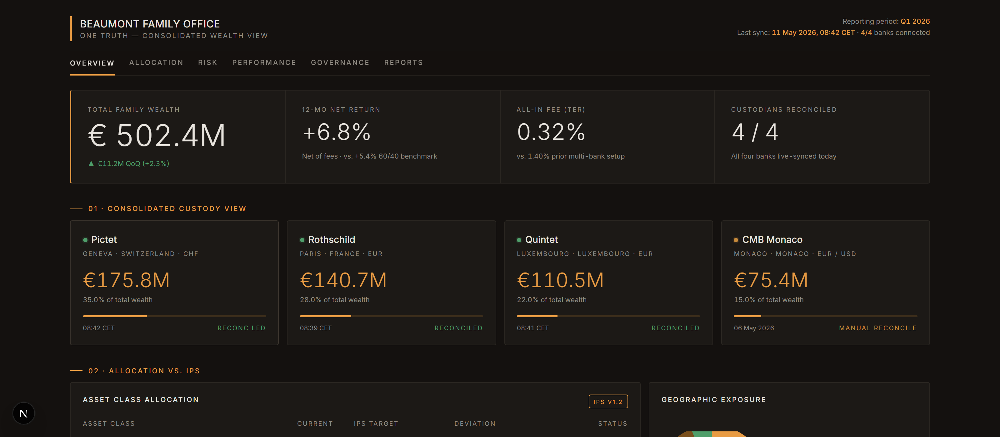
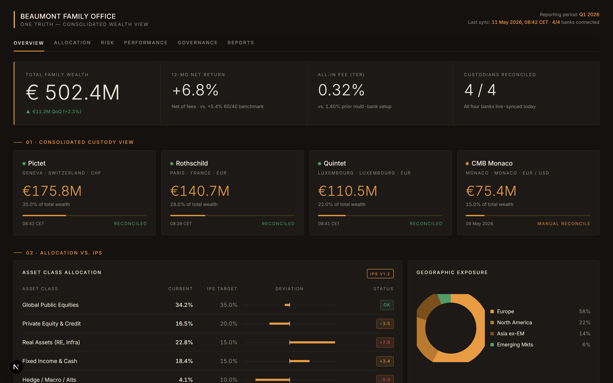
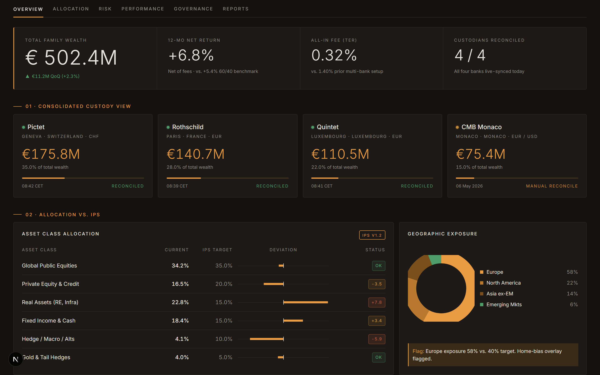
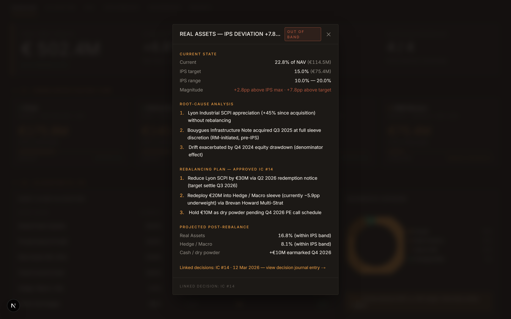
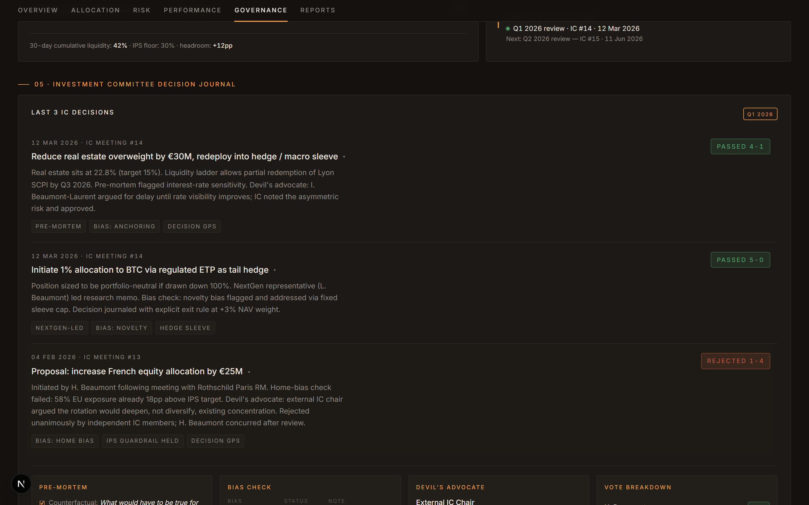
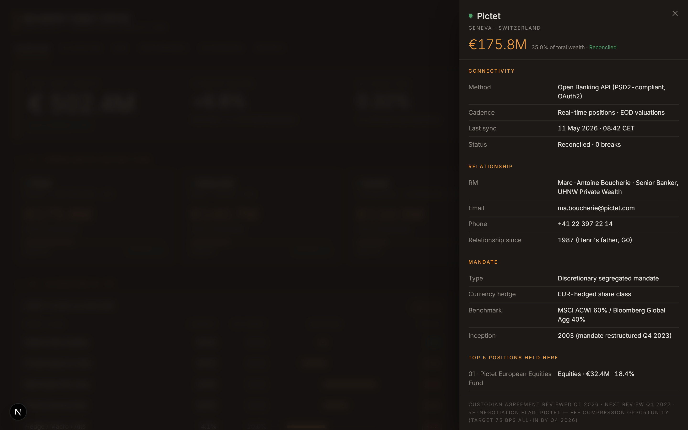
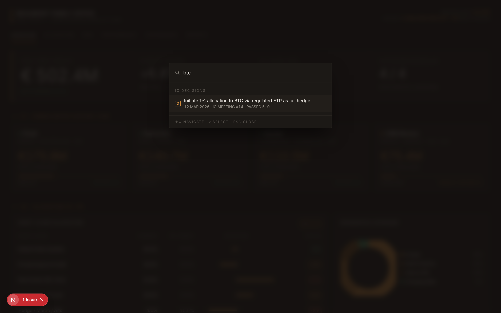
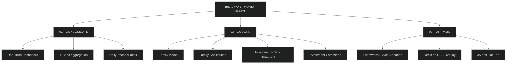
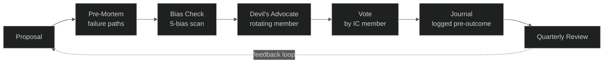
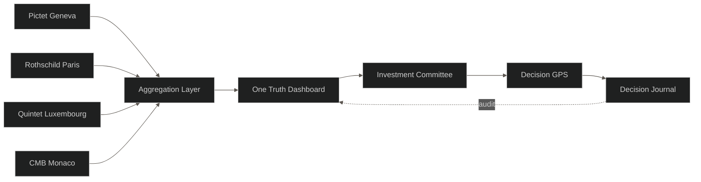

<div align="center">



# Beaumont Family Office — One Truth Dashboard

### *"You don't need another bank. You need an Institution."*

[](https://beaumont-mfo.vercel.app)
[](https://vercel.com)
[](https://nextjs.org)
[](https://www.typescriptlang.org)
[](https://tailwindcss.com)
[](https://opensource.org/licenses/MIT)

**[→ Open the live dashboard](https://beaumont-mfo.vercel.app)**

A working prototype of a Multi-Family Office consolidation dashboard, built as the central artefact for a 6-minute pitch in the Family Office & Wealth Management course at IE Business School (Master in Finance, May 2026).

</div>

---

## See it in action


> *Eight seconds. Three clicks. Three reveals. That's the entire pitch's differentiator.*

---

## What you're looking at

| | |
|:---:|:---:|
|  |  |
| **€502.4M consolidated across four banks** · Reconciled 11 May 2026, 08:42 CET. Today the Beaumonts have no single view of this. | **Allocation vs. IPS, with deviations flagged in real time** · Real Assets +7.8pp over target, Hedge / Macro −5.9pp under. Europe overweight at 58% triggers the home-bias overlay. |
|  |  |
| **Click any deviation pill** · Root-cause analysis, IC-approved rebalancing plan, link to the related decision journal entry. | **Decision GPS audit trail** · Pre-mortem (3 failure paths), 5-bias check, devil's advocate quote, vote-by-member breakdown. HARKing prevention timestamps. |
|  |  |
| **Drill into any custodian** · Connectivity, mandate type, top positions held, fee breakdown, re-negotiation flags. | **Cmd+K from anywhere** · Search positions, IC decisions, sections, reports, settings. Type "btc" → land on the BTC decision. |

---

## Three-pillar solution architecture



---

## Situation

The Beaumonts — a fictional French old-money family — bank across **four jurisdictions** with no consolidated view. Six numbers describe today:

| Number | What it tells us |
|---|---|
| **4** | private banks, no consolidated view |
| **1.4%** | all-in cost · ~€7M / year (Capgemini WWR 2024) |
| **4.2%** | 10-year net return vs. 6.5% on a passive 60/40 (Bloomberg) |
| **0** | IPS · 0 IC · 0 Family Constitution |
| **70%** | of UHNW family wealth transitions fail by G3 (Williams & Preisser, 2003) |
| **1** | health scare from succession chaos |

## Complication

It is not a portfolio problem. It is a **governance problem**.

- **The 2.3pp performance gap** = ~€11.5M / year of foregone return, compounded over a 30-year horizon
- **The 2023 silent migration** — a bank merger quietly wrapped the family's mandate into a fund-of-funds
- **The retired RM** — Henri's 40-year Geneva relationship replaced by a junior in late 2025
- **The trigger** — Henri's early-2026 health scare exposes the absence of a succession plan

Henri has no succession plan. Isabelle has no consolidated view. Louis has no seat at the table.

That is not a portfolio. That is an institution that does not exist yet.

## Solution

### 01 · Consolidate
Aggregate all four custodians into a single operating picture. **This dashboard is the proof.**

### 02 · Govern
Family Vision → Family Constitution → Investment Policy Statement → Investment Committee.

### 03 · Optimize
Endowment-style allocation (35 / 20 / 15 / 15 / 10 / 5) with **Decision GPS** behavioural overlay on every IC vote:



### The economics
- Today: **1.40% all-in** = €7M / year
- With us: **0.60% all-in** = €3M / year
- **€4M annual fee saving + €11.5M performance gap closure = €15.5M annual upside**

### The ask
Not to move money. **One quarter:** 90-day audit at €120k fixed · two family workshops · decision point on day 90.

---

## Data flow



---

## Live demo

**[beaumont-mfo.vercel.app](https://beaumont-mfo.vercel.app)** · fully public, no login

The 25-second Speaker 2 demo sequence:

1. Land on `/` — sync animation reconciles four banks in 2 seconds
2. Click `ALLOCATION` tab → smooth-scroll
3. Click the red `+7.8` Real Assets pill → rebalancing plan modal
4. Close, scroll to Section 05
5. Click `REJECTED 1-4` → Decision GPS audit trail unfolds inline
6. Point at the audit-trail footer: *"pre-vote rationale logged at 09:14 CET, outcome logged at 11:47 CET — HARKing prevention: PASSED."*

---

## Tech stack

| Layer | Choice | Why |
|---|---|---|
| Framework | Next.js 14 (App Router) | Static prerender, no backend needed |
| Language | TypeScript | Self-documenting numbers |
| Styles | Tailwind CSS v4 | Custom design tokens, no UI kit overhead |
| Charts | Recharts | One donut, one line chart, both minimal |
| Overlays | Radix UI primitives | Focus trap, ESC, scroll lock — accessibility for free |
| QR | qrcode | Client-side QR generation |
| Hosting | Vercel | One command, public URL |
| Font | Inter (next/font/google) | Only font used |

**Design philosophy:** *Bloomberg terminal meets a private bank annual report.* Flat. Dense. Calm. Expensive. No emojis. No gradients (except progress bars). No rounded-lg.

---

## Local development

```bash
git clone https://github.com/Jannikwendt/beaumont-dashboard.git
cd beaumont-dashboard
npm install
npm run dev
# → http://localhost:3000
```

| Script | What it does |
|---|---|
| `npm run dev` | Local dev server with hot reload |
| `npm run build` | Production build (static prerender) |
| `npm run start` | Serve the production build |
| `npm run lint` | ESLint |
| `npx tsc --noEmit` | Type check |
| `npm run screenshots:dev` | Regenerate the 7 README screenshots via Playwright |

---

## Project structure

```
beaumont-dashboard/
├── app/                     # Next.js App Router
│   ├── layout.tsx           # Inter font, OG metadata, favicon
│   ├── page.tsx             # Composes all sections inside <OverlayProvider>
│   └── globals.css          # Tailwind v4 tokens + tabular-nums + print + pulse keyframes
├── components/
│   ├── Header.tsx           # Brand + reporting period
│   ├── Tabs.tsx             # Scroll-anchor tabs with active-section observer
│   ├── Hero.tsx             # 4 KPIs with source-citation tooltips
│   ├── CustodyView.tsx      # Section 01 · click → side panel + sync animation
│   ├── Allocation.tsx       # Section 02 · deviation bars + IPS modal trigger
│   ├── Geographic.tsx       # Donut + pulsing amber home-bias flag
│   ├── RiskMetrics.tsx      # Section 03 · 4 KPI cards
│   ├── Concentrations.tsx   # Top-10 table · row → instrument side panel
│   ├── Currency.tsx         # FX bars
│   ├── PerformanceChart.tsx # 12-mo line chart
│   ├── LiquidityLadder.tsx  # Section 04 left
│   ├── ReportingCadence.tsx # Section 04 right
│   ├── DecisionJournal.tsx  # Section 05 · expandable IC decisions with Decision GPS
│   ├── Footer.tsx
│   ├── SectionLabel.tsx     # Shared "NN · TITLE" label component
│   ├── overlays/            # Modal, SidePanel, Tooltip, CommandPalette primitives
│   └── onboarding/          # GuidedTour, HelpButton, ShareModal, InvitationCard
├── lib/
│   └── data.ts              # Every number on the page — single source of truth
├── scripts/
│   └── capture-screenshots.ts  # Playwright script that regenerates docs/images/
├── docs/
│   ├── CAPTURE_GIF.md       # How to record the demo GIF
│   └── images/              # All README assets
└── public/                  # favicon, og-card, etc.
```

---

## Iteration history

| Version | Focus | Highlights |
|---|---|---|
| **v1** | Static prototype | Layout, design tokens, hard-coded data — set the visual quality bar |
| **v2** | Interactive overlays | Modals, side panels, Decision Journal expansion, Cmd+K, source tooltips |
| **v3** | Self-explaining UX | Sync animation, pulse flags, guided tour, help button, share modal, OG card |
| **v4** | Repo-as-brochure | Auto-screenshots, demo GIF, Mermaid diagrams, restructured README |
| **v5** *(planned)* | Decision GPS wizard | `+ New IC Decision` 4-step flow for hypothetical votes |

---

## Acknowledgements

- **Prof. Markus Schuller** (Panthera Solutions) — Decision GPS framework, Generation-3 portfolio thinking
- **Williams & Preisser** (2003) — 70% G3 wealth-transition failure statistic
- **Brinson, Hood & Beebower** (1986 / 1991) — 90% of long-term performance variability from strategic asset allocation
- **Capgemini World Wealth Report 2024** — UHNW European fee benchmarks
- **Bloomberg** — 60/40 ACWI / Global Aggregate benchmark composition

---

## Disclaimer

The Beaumont family, their wealth, the four custodian banks, the positions, the IC decisions, the fee math, and every number on the dashboard are **fictional**, constructed for an academic pitch exercise at IE Business School. Nothing in this repository constitutes financial advice. The dashboard is a UI prototype with hard-coded mock data and no backend.

---

<div align="center">

**MIT License** · do whatever you want with the code · attribution appreciated but not required

**[→ Open the live dashboard](https://beaumont-mfo.vercel.app)**

*One family. One institution. Thirty years of clarity.*

</div>
